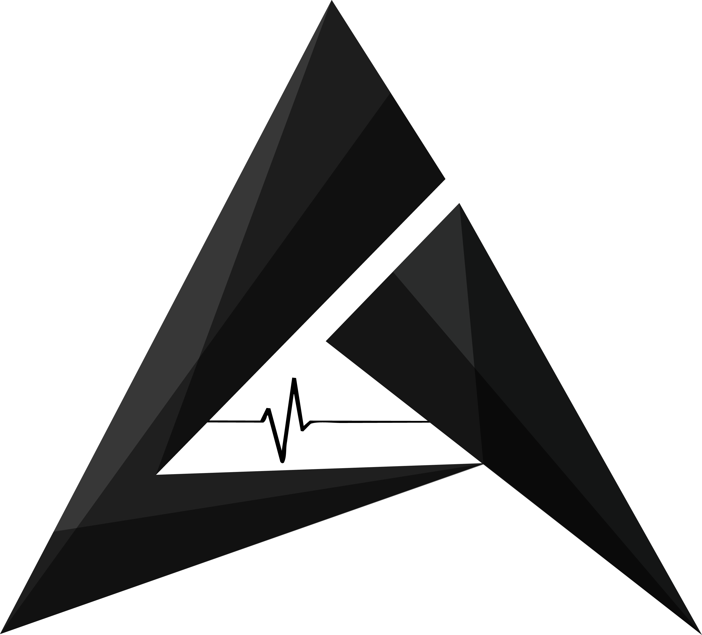

# Aaveg

Website for Aaveg.

## Developing

### Built With

React js and react-bootstrap

### Prerequisites

You need to install Node >= 8.10 and npm >= 5.6

### Setting up Dev

```shell
git clone https://github.com/AananthV/AavegFrontend
cd AavegFrontend
cp config/config.example.js config/config.js
#Replace the values in config.js
npm install
```

### General Coding Advice

- Follow the coding style given below
- Maintain the project structure (pages, components etc).
- Use ES6+ features to write clean code. Especially async await
- _Update README_

## Api Reference

Website and app backend for Aaveg - https://github.com/AananthV/AavegWebsite

